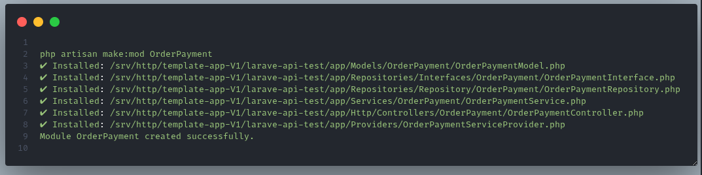

# Module-Generator

[](https://www.php.net/)
[](LICENSE)

### _Module-Generator in Laravel_

Laravel Module Generator with layered architecture: Model, Repository, Service, Controller, Provider.
Generate a complete module structure in Laravel, including:

- Model
- Repositories/Repository + Interface
- Service
- Controller
- Service Provider

## 🏗 Architecture Overview

### Generate Module

Generated modules follow a layered service–repository architecture:

```
ModuleName/
├── Models/
│   └── ModuleName.php
│
├── Repositories/
│   ├── Interfaces/
│   │   └── ModuleName/
│   │       └── ModuleNameRepositoryInterface.php
│   └── Repository/
│       └── ModuleName/
│           └── ModuleNameRepository.php
│
├── Services/
│   └── ModuleName/
│       └── ModuleNameService.php
│
├── Http/
│   └── Controllers/
│       └── ModuleName/
│           └── ModuleNameController.php
│
└── Providers/
    └── ModuleNameServiceProvider.php
```

### Generate Standard API

This package provides a standardized API foundation for Laravel applications by implementing a Centralized API Response & Exception Handling Pattern.
All HTTP responses are forced into a unified JSON format, and all exceptions are handled in a single, centralized layer, ensuring consistency across the entire application.
High-level flow

```
Exceptions → Middleware / Exception Handler → Global API Response

```

#### ✨ Key Features

✅ Unified JSON response structure
✅ Centralized exception handling
✅ Opinionated API contract (consistent success & error responses)
✅ Middleware-based response enforcement
✅ Framework-agnostic business logic (HTTP-agnostic services)
✅ Suitable for packages, microservices, and large-scale APIs

## 🧠 Architectural Principles

This package follows Clean Architecture–inspired layering, where each layer has a single and well-defined responsibility.

1. Model
   Represents the database table (Eloquent ORM).
   ❌ No business logic
   ❌ No complex queries
2. Repository + Interface
   Encapsulates all data access logic and abstracts the persistence layer.
   - Defines contracts via interfaces
   - Implements database queries (Eloquent, Query Builder, etc.)

   Benefits:
   ✅ Enables easy testing (mocking repositories)
   ✅ Allows swapping data sources without affecting business logic 3. Service

3. Service
   Contains business rules and application use cases.
   Responsibilities:
   - Orchestrates workflows
   - Applies domain validation

   Throws domain-specific exceptions
   ✅ HTTP-agnostic
   ❌ No request / response handling
   ❌ No direct database queries

4. Controller
   Acts as the delivery layer.
   Responsibilities:
   - Receives HTTP requests.
   - Delegates execution to services.
   - Returns standardized API responses.

   Controllers remain thin and predictable.

5. Service Provider
   Responsible for dependency injection configuration.
   - Binds interfaces to concrete implementations.
   - Registers package services, middleware, and handlers.

   This ensures loose coupling and extensibility.

### Centralized Exception Handling

    All exceptions—framework, validation, authorization, or domain-specific—are handled in a single place and transformed into a standardized API response.
    This pattern is also known as:
    - Exception-to-Response Mapping.
    - API Response Envelope Pattern.
    - Opinionated API Layer.

## Requirements

- PHP >= 8.1
- Laravel 9, 10, 11, 12

## Installation

Install via Composer:

```
composer require ixspx/module-generator
```

## ⚙ Manual Provider Registration

If package discovery is disabled, register the provider manually in bootstrap/providers.php:

```
'providers' => [
    // Other service providers...
    Ixspx\ModuleGenerator\Providers\ModuleGeneratorServiceProvider::class,
]
```

## 🛠 Usage

#### Generate Standard API Structure

Run the following command to generate the standard API structure:

```
  php artisan make:api-install
```

You may add the --force option to overwrite existing API files.

##### Register API Configuration

After running make:api-install, you must manually register the API configuration in bootstrap/app.php:

```
use Illuminate\Support\Facades\Route;
use App\Exceptions\ApiExceptionRegistrar;
use App\Http\Middleware\ForceJsonResponse;


return Application::configure(basePath: dirname(__DIR__))
    ->withRouting(
        web: __DIR__ . '/../routes/web.php',
        commands: __DIR__ . '/../routes/console.php',
        health: '/up',
        then: function ($router) {
            Route::prefix('api/v1')
                ->group(base_path('routes/api.php'));
        }
    )
    ->withMiddleware(function (Middleware $middleware): void {
        $middleware->append(ForceJsonResponse::class);
    })
    ->withExceptions(function (Exceptions $exceptions): void {
        ApiExceptionRegistrar::register($exceptions);
    })->create();

```

#### Generate a Module

Generate a new module using the following command:

```
  php artisan make:mod {{nameModule}}
```

Example:

```
php artisan make:mod OrderPayment
```

After the command finished, you will see a notification simillar to the flowing:



##### ⚠️ Important:

You must register the generated module service provider manually in bootstrap/providers.php.
This command generates a complete module structure based on a predefined layered architecture (Controller, Service, Repository, Interface, etc.).

#### OR Generate API Response Helper

To generate the API response helper, run:

```
php artisan make:api-response
```

## 📄 License

This project is open-source software licensed under the MIT License.
See the see [LICENSE](LICENSE)
